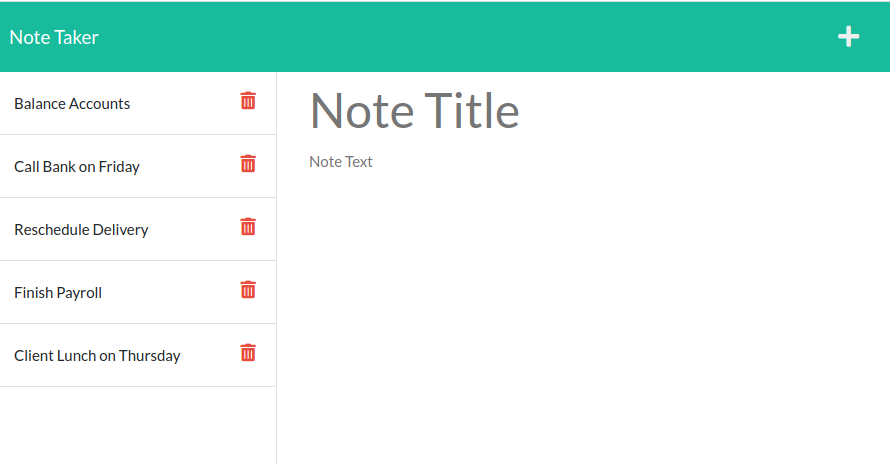

# Note Taker Starter Code

## Description
This application can be used to write and save notes. It will use an Express.js back end and will save and retrieve note data from a JSON file.

## User Story
* AS A small business owner, I WANT to be able to write and save notes
* SO THAT I can organize my thoughts and keep track of tasks I need to complet

## Acceptance Criteria
GIVEN a note-taking application 
WHEN I open the Note Taker 
THEN I am presented with a landing page with a link to a notes page 
WHEN I click on the link to the notes page 
THEN I am presented with a page with existing notes listed in the left-hand column, plus empty fields to enter a new note title and the note’s text in the right-hand column 
WHEN I enter a new note title and the note’s text 
THEN a Save icon appears in the navigation at the top of the page 
WHEN I click on the Save icon 
THEN the new note I have entered is saved and appears in the left-hand column with the other existing notes 
WHEN I click on an existing note in the list in the left-hand column 
THEN that note appears in the right-hand column 
WHEN I click on the Write icon in the navigation at the top of the page 
THEN I am presented with empty fields to enter a new note title and the note’s text in the right-hand column 

## Languages
HTML, CSS, JavaScript, Node.js, Inquirer, Express.js, npm modules

## Installation
The application require the use of node.js, Express.js, uuid & path for running the application.

## Usage
This application is for users who wanted to have notes to remind them of tasks that need to be done or to recall important things. Users will be able to add, retrive and delete notes.

## Screen Shots of the HTML
Adding Notes

Retrieving Notes

Deleting Notes

## Deployed application link
https://secure-journey-45023.herokuapp.com

## Github Page: 
https://github.com/amykep/miniature-eureka
